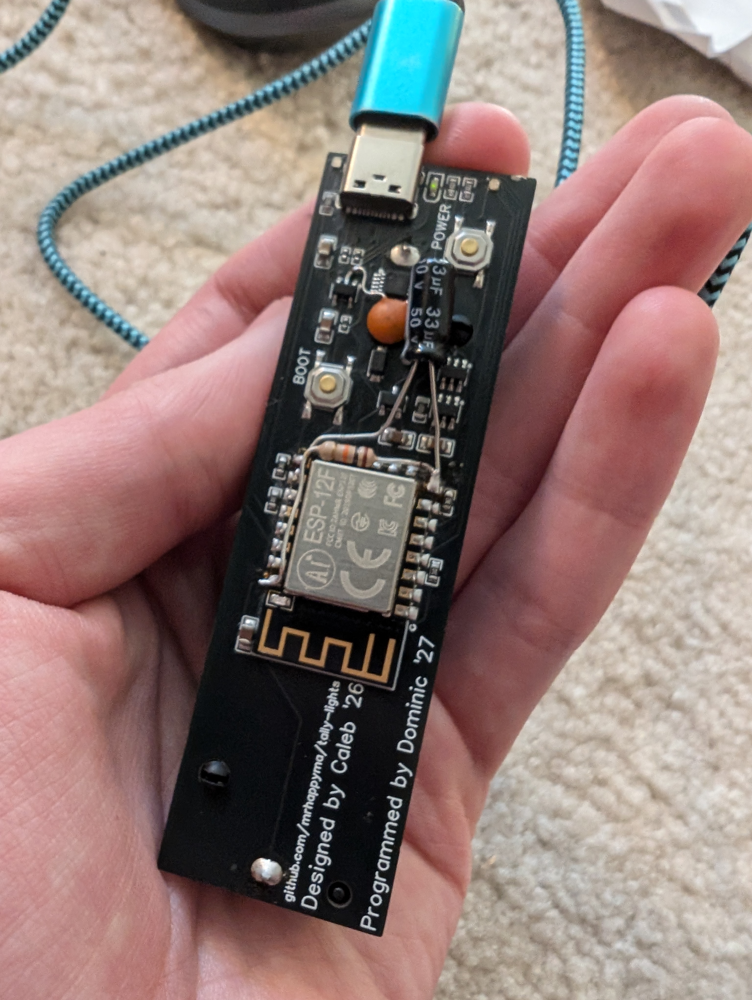

# tally-lights

janky little blinky lights for when cameras are live

very wip i havent touched this code in a while

- `/fw` - board firmware
- `/hub` - web interface & server that boards connect to
- `/pcb` - board design
- `/case` - case design
